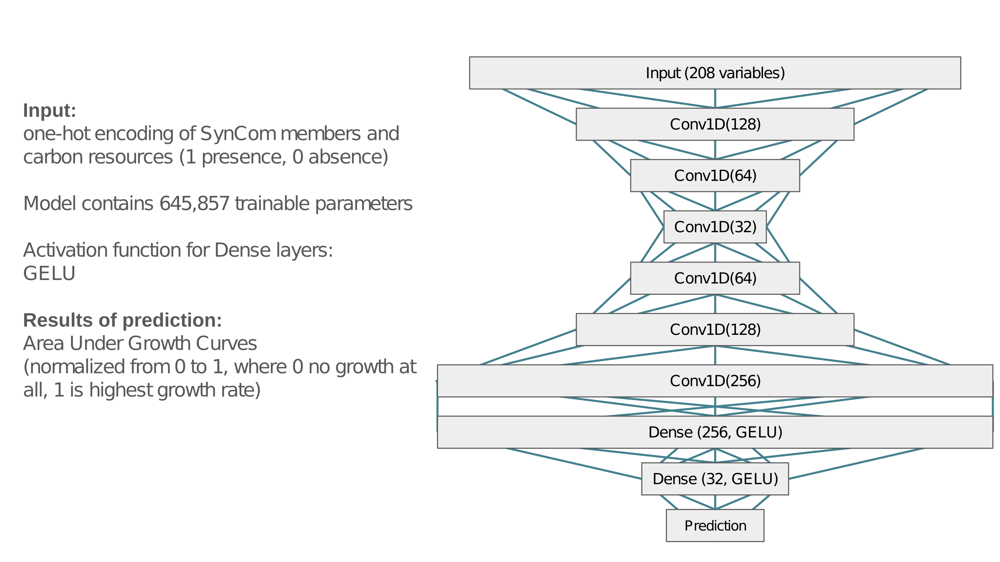

# CNN model to predict the community growth
### Model
The Model folder contains the checkpoints of the training and the training curves plot.

### Jupyter_notebook
The jupyter notebook file contains code for training the model, predictions of the growth, and plotting figures.

### Plots
The heatmap of the predicted growth on the validation dataset and the plot of the accuracy of the trained model.

### Tables
The Tables folder contains the main table (df_labeled.tsv) of results of the experiments demonstrating the community growth on various carbon sources. The table was used for training the CNN model. The names of the community members and carbon sources are encoded. The carbon_sources_indices.tsv table shows the relation between carbon sources and indices for the heatmap of predicted growth.
